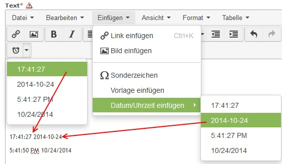

Contao Extension: TinyMceInsertDateTime
=======================================

Special TinyMCE plugin to add date and time buttons to the editor.

The sources of this plugin could be found [here](http://www.tinymce.com/wiki.php/Plugin:insertdatetime).

Now for TinyMCE 4.

Installation
------------

Install the extension via composer: [cliffparnitzky/tiny-mce-insert-date-time](https://packagist.org/packages/cliffparnitzky/tiny-mce-insert-date-time).

If you prefer to install it manually, download the latest release here: https://github.com/cliffparnitzky/TinyMceInsertDateTime/releases

Tracker
-------

https://github.com/cliffparnitzky/TinyMceInsertDateTime/issues

Compatibility
-------------

- min. Contao version: >= 3.3.0
- max. Contao version: <  3.6.0

Dependency
----------

- To load this plugin and add it to the configuration the extension [[TinyMcePluginLoader]](https://github.com/cliffparnitzky/TinyMcePluginLoader) has to be installed.

Screenshot
----------

Additional information
----------------------

### Special notes

This plugin uses the default date and time format from the system settings.

### Information in the wiki

#### Create a new ...

* [Creating a new plugin](https://github.com/cliffparnitzky/TinyMcePluginLoader/wiki/Creating-a-new-plugin)
* [Creating a new bundle](https://github.com/cliffparnitzky/TinyMcePluginLoader/wiki/Creating-a-new-bundle)
* [Creating a new setup](https://github.com/cliffparnitzky/TinyMcePluginLoader/wiki/Creating-a-new-setup)

#### Installation hints
* [Install manually](https://github.com/cliffparnitzky/TinyMcePluginLoader/wiki/Install-manually)

#### Bug report hints

* [Report a bug](https://github.com/cliffparnitzky/TinyMcePluginLoader/wiki/Report-a-bug)